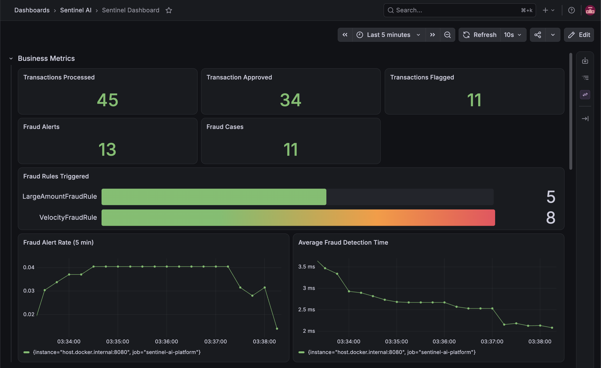
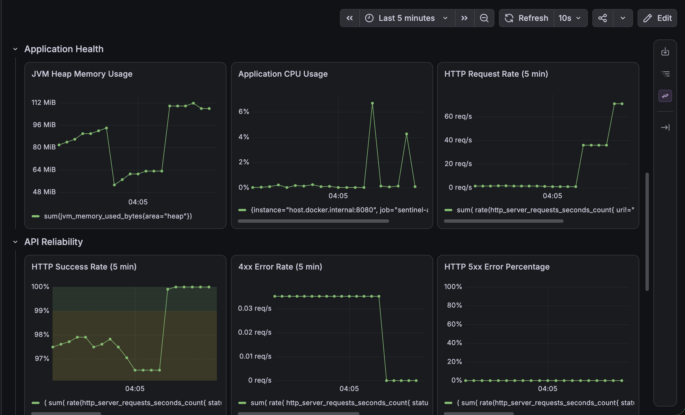
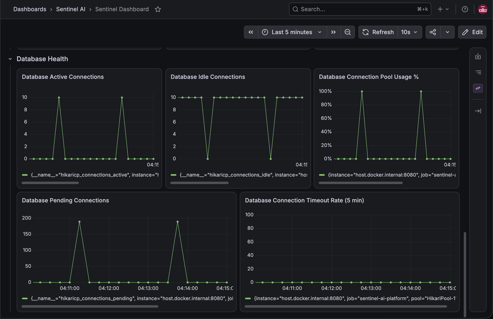

<div align="center">

# Sentinel AI

### Fraud Detection & Investigation Platform

A modular, backend platform for transaction processing, fraud detection, investigation workflows, and operational observability. The platform prioritizing architecture, maintainability, observability, and operational excellence.

---


</div>

---

# Overview

Sentinel AI is a fraud detection and investigation platform built with **Spring Boot**.

The platform processes financial transactions, evaluates configurable fraud detection rules, generates fraud alerts, manages investigation cases, records audit events, exposes operational metrics, and provides production-grade observability.

The architecture follows a **Modular Monolith** approach with explicit domain boundaries, enabling the system to evolve toward an event-driven microservices architecture without significant changes to core business logic.

Rather than optimizing for rapid feature delivery, Sentinel AI prioritizes:

- Explicit domain ownership
- Clean architecture
- Maintainability
- Testability
- Observability
- Scalability
- Evolutionary architecture

---

# Key Features

### Fraud Detection

- Rule-based fraud detection engine
- Large transaction detection
- Velocity-based fraud detection
- Extensible Strategy Pattern for adding new fraud rules

### Transaction Processing

- Transaction ingestion API
- Validation pipeline
- DTO-based API boundaries
- Transaction lifecycle management
- Duplicate transaction prevention

### Investigation Workflow

- Automatic fraud alert generation
- Fraud case creation
- Case lifecycle management
- Investigation status workflow

### Operational Visibility

- Audit logging
- Fraud metrics API
- Correlation ID tracing (MDC)
- Micrometer metrics
- Prometheus integration
- Grafana dashboards

### Data Management

- PostgreSQL persistence
- Flyway database migrations
- Repository abstraction
- Interface-based projections

### Testing

- Unit testing
- Repository testing
- Integration testing
- PostgreSQL Testcontainers
- H2 reference testing

---

# Architecture

```text
                          HTTP Request
                               │
                               ▼
                        REST Controller
                               │
                               ▼
                     Request Validation
                               │
                               ▼
                       Service Layer
                               │
          ┌────────────────────┴────────────────────┐
          │                                         │
          ▼                                         ▼
 Fraud Detection Engine                     Business Services
          │                                         │
          └────────────────────┬────────────────────┘
                               ▼
                            Mapper
                               │
                               ▼
                         Repository Layer
                               │
                               ▼
                           PostgreSQL
```

---

# Transaction Processing Flow

```text
Client Request
      │
      ▼
Transaction API
      │
      ▼
Validate Request
      │
      ▼
Persist Transaction
      │
      ▼
Execute Fraud Rules
      │
      ▼
Generate Fraud Alerts
      │
      ▼
Create Investigation Case
      │
      ▼
Write Audit Log
      │
      ▼
Return API Response
```

---

# Engineering Principles

Sentinel AI is built around several architectural principles that guide implementation across all modules.

| Principle | Description |
|------------|-------------|
| Modular Monolith | Strong domain boundaries with a clear migration path toward distributed services |
| Package by Domain | Business capabilities are organized around domains rather than technical layers |
| Separation of Concerns | Controllers, services, repositories, entities, DTOs, and infrastructure each own distinct responsibilities |
| Clean Architecture | Infrastructure remains isolated from business workflows |
| Constructor Injection | Explicit dependencies with improved testability |
| DTO Boundaries | Persistence models are never exposed through public APIs |
| Strategy Pattern | Fraud detection rules are independently extensible |
| Repository Pattern | Persistence logic remains isolated from business orchestration |
| Evolutionary Design | Components are designed to be replaceable as the platform evolves |

---

# Technology Stack

| Category | Technologies |
|-----------|--------------|
| Language | Java 21 |
| Framework | Spring Boot |
| Web | Spring Web |
| Build Tool | Maven |
| Validation | Bean Validation |
| Persistence | Spring Data JPA |
| Database | PostgreSQL |
| Database Migration | Flyway |
| Testing | JUnit 5, Mockito, Spring Boot Test |
| Integration Testing | PostgreSQL Testcontainers, H2 |
| Monitoring | Micrometer |
| Metrics | Prometheus |
| Dashboards | Grafana |
| Containers | Docker, Docker Compose |

---

# Current Capabilities

| Capability | Status |
|------------|:------:|
| Transaction Processing | ✅ |
| Fraud Detection Engine | ✅ |
| Fraud Alerts | ✅ |
| Fraud Investigation Cases | ✅ |
| Audit Logging | ✅ |
| Fraud Metrics API | ✅ |
| PostgreSQL Persistence | ✅ |
| Flyway Migrations | ✅ |
| Global Exception Handling | ✅ |
| Correlation ID Logging (MDC) | ✅ |
| Micrometer Metrics | ✅ |
| Prometheus Integration | ✅ |
| Grafana Dashboards | ✅ |
| PostgreSQL Testcontainers | ✅ |
| Docker Compose Infrastructure | ✅ |

---

# Current Architecture Roadmap

```text
                   Current State

               Modular Monolith
                      │
                      ▼
          Strong Domain Boundaries
                      │
                      ▼
         Infrastructure Expansion
                      │
                      ▼
       Event-Driven Communication
                      │
                      ▼
              Distributed Services
                      │
                      ▼
             Microservice Extraction
```

The current architecture deliberately establishes clear domain ownership and infrastructure boundaries before introducing distributed system complexity. This approach enables incremental evolution while preserving core business workflows.

---

# 📁 Project Structure

The project follows a **package-by-domain** structure rather than a traditional layer-first approach. Each business capability owns its controllers, services, repositories, entities, DTOs, and supporting components, keeping responsibilities localized and reducing coupling.

```text
sentinel-ai
│
├── infrastructure
│   ├── grafana
│   │   ├── dashboards
│   │   └── provisioning
│   └── prometheus
│
├── docker-compose.yml
│
└── src/main/java/com/sentinelai/platform
    │
    ├── transaction
    ├── fraud
    ├── alert
    ├── fraudcase
    ├── audit
    ├── common
    └── config
```

---

# 📦 Domain Modules

## Transaction

Responsible for receiving, validating, and persisting incoming financial transactions.

**Responsibilities**

- Transaction ingestion
- Request validation
- DTO mapping
- Duplicate transaction prevention
- Transaction lifecycle management
- Persistence

---

## Fraud

Encapsulates the fraud detection engine and rule evaluation pipeline.

**Responsibilities**

- Fraud rule orchestration
- Strategy-based rule execution
- Velocity tracking
- Fraud metrics aggregation

Current fraud rules include:

- Large Amount Detection
- Velocity Detection

The fraud engine is extensible through the `FraudRule` strategy interface, allowing new detection rules to be introduced without modifying the orchestration layer.

---

## Alert

Responsible for recording fraud alerts generated by the fraud engine.

Each alert stores:

- Triggered rule
- Detection reason
- Transaction reference
- Creation timestamp

This module is intentionally isolated from the fraud engine so alert persistence can evolve independently.

---

## Fraud Case

Represents the investigation lifecycle after suspicious activity has been detected.

Responsibilities include:

- Automatic case creation
- Investigation workflow
- Status transitions
- Case retrieval
- Case updates

Current lifecycle:

```text
OPEN
   │
   ▼
UNDER_REVIEW
   ├──────────────┐
   ▼              ▼
CONFIRMED     FALSE_POSITIVE
   │              │
   └──────┬───────┘
          ▼
       CLOSED
```

Invalid transitions are rejected through explicit domain validation.

---

## Audit

Maintains an immutable history of significant business events.

Currently recorded events include:

- Transaction Created
- Transaction Approved
- Transaction Flagged
- Fraud Alert Generated

Audit logging remains isolated from business orchestration to avoid coupling operational concerns with domain logic.

---

## Common

Contains shared infrastructure used across multiple modules.

Examples include:

- Global exception handling
- Error responses
- Correlation ID filter
- Utility classes
- Shared DTOs

---

## Config

Application configuration and framework integration.

Examples include:

- Spring configuration
- Bean registration
- Infrastructure configuration

---

# Layer Responsibilities

Each layer owns a single responsibility within the request lifecycle.

| Layer | Responsibility |
|--------|----------------|
| Controller | HTTP transport and request handling |
| DTO | Public API contracts |
| Service | Business workflow orchestration |
| Repository | Data persistence |
| Entity | Database model |
| Mapper | Conversion between DTOs and entities |
| Configuration | Framework and infrastructure setup |

Business logic is intentionally centralized within the service layer, keeping controllers thin and repositories persistence-focused.

---

# Request Lifecycle

A typical transaction flows through the application as follows:

```text
HTTP Request
      │
      ▼
TransactionController
      │
      ▼
Request Validation
      │
      ▼
TransactionService
      │
      ▼
TransactionMapper
      │
      ▼
TransactionRepository
      │
      ▼
Persist Transaction
      │
      ▼
FraudDetectionService
      │
      ▼
FraudRule Pipeline
      │
      ▼
FraudAlertService
      │
      ▼
FraudCaseService
      │
      ▼
AuditService
      │
      ▼
HTTP Response
```

---

# Fraud Detection Pipeline

Fraud detection is implemented using the **Strategy Pattern**, allowing each fraud rule to remain independent while the orchestration layer remains unchanged.

```text
Incoming Transaction
          │
          ▼
FraudDetectionService
          │
          ▼
──────────────────────────────────────
│ LargeAmountFraudRule               │
├────────────────────────────────────┤
│ VelocityFraudRule                  │
└────────────────────────────────────┘
          │
          ▼
FraudRuleResult
          │
          ▼
Fraud Alert
          │
          ▼
Fraud Investigation Case
```

Adding a new fraud rule requires implementing the `FraudRule` interface and registering it with the detection engine.

---

# Fraud Investigation Workflow

Flagged transactions automatically progress into an investigation workflow.

```text
Transaction
      │
      ▼
Fraud Detection
      │
      ▼
Fraud Alert
      │
      ▼
Fraud Case Created
      │
      ▼
Analyst Review
      │
      ▼
Status Transition
      │
      ▼
Case Closed
```

Future enhancements will introduce analyst assignment, investigation notes, notifications, and AI-assisted case analysis without altering the existing workflow.

---

# 🗄️ Database Design

The persistence layer currently consists of four primary business tables.

| Table | Purpose |
|--------|---------|
| transactions | Financial transaction records |
| fraud_alerts | Triggered fraud alerts |
| fraud_cases | Investigation workflow |
| audit_logs | Immutable audit history |

Database schema evolution is managed exclusively through **Flyway migrations**, ensuring every structural change is version-controlled and reproducible.

---

# 🛠️ Database Migration Strategy

Schema changes are managed using Flyway.

Current migration history:

| Version | Description |
|----------|-------------|
| V1 | Initial schema |
| V2 | Transactions table |
| V3 | Fraud alerts table |
| V4 | Audit logs table |
| V5 | Transaction indexes |
| V6 | Fraud cases table |

Flyway acts as the authoritative source for schema evolution. Manual database changes are intentionally avoided.

---

# 🏛️ Architectural Decisions

The project intentionally favors architectural decisions that improve maintainability and future evolution.

| Decision | Rationale |
|----------|-----------|
| Modular Monolith | Strong domain boundaries before distributed systems |
| Package by Domain | Aligns code organization with business capabilities |
| DTO Boundaries | Prevents persistence models from leaking into public APIs |
| Constructor Injection | Explicit dependencies and improved testability |
| Strategy Pattern | Extensible fraud detection rules |
| Repository Pattern | Separation of persistence from business logic |
| Interface Projections | Efficient database aggregations |
| Flyway | Version-controlled schema management |
| PostgreSQL | Production database |
| Testcontainers | Production-like integration testing |
| MDC Correlation IDs | End-to-end request tracing |
| Docker Compose | Local infrastructure orchestration |

---

# 🌐 API Overview

Current REST endpoints expose the platform's primary business capabilities.

| Method | Endpoint | Description |
|---------|----------|-------------|
| POST | `/api/v1/transactions` | Create a transaction |
| GET | `/api/v1/fraud/metrics` | Retrieve fraud metrics |
| GET | `/api/v1/fraud-cases` | List investigation cases |
| GET | `/api/v1/fraud-cases/{caseNumber}` | Retrieve a specific case |
| PATCH | `/api/v1/fraud-cases/{caseNumber}/status` | Update investigation status |

Detailed request and response examples are provided later in this documentation.

---

---

# 🚀 Getting Started

## Prerequisites

Ensure the following tools are installed before running the application.

| Software | Version |
|-----------|-----|
| Java | 21+ |
| Maven | 3.9+ |
| Docker Desktop | Latest |
| Git | Latest |

---

# ⚙️ Local Development

Clone the repository.

```bash
git clone https://github.com/YashM7/sentinel-ai.git
```

Navigate into the project.

```bash
cd sentinel-ai
```

Start the supporting infrastructure.

```bash
docker compose up -d
```

Run the application.

```bash
./mvnw spring-boot:run
```

or

```bash
mvn spring-boot:run
```

The application will start on

```
http://localhost:8080
```

---

# 🐳 Infrastructure

Sentinel AI includes a Docker Compose configuration for running supporting infrastructure locally.

Current services include:

| Service | Purpose                   |
|----------|---------------------------|
| PostgreSQL | Primary database (Docker) |
| Prometheus | Metrics collection        |
| Grafana | Metrics visualization     |

## 🗄️ PostgreSQL

PostgreSQL runs as a Docker container and does not require a local PostgreSQL installation.

The Docker Compose configuration creates:

- Database: sentinel_ai
- Username: sentinel
- PostgreSQL container port: `5432`
- Host port: `5433`

Database data is persisted using the `postgres-data` Docker volume.

Stopping the infrastructure with:

docker compose down does not delete the database data.

To completely remove the PostgreSQL data and recreate the database:

```
docker compose down -v
```

## 📊 Prometheus
Prometheus is used to scrape and store time-series metrics from the Java application.
* Port: `9090`
* Access URL: [http://localhost:9090](http://localhost:9090)
* Configuration: Scrapes application metrics via the `/actuator/prometheus` endpoint.

## 📈 Grafana
Grafana provides the visual dashboard interface for analyzing your Prometheus metrics.
* Port: `3000`
* Access URL: [http://localhost:3000](http://localhost:3000)
* Default Credentials:
    * Username: `admin`
    * Password: `admin`
* **Setup Note:** On your first login, Grafana will prompt you to change this default password. You can skip this step or set a new one.


The infrastructure is designed so application services remain independent while operational tooling can evolve separately.

---

# 📊 Observability

Operational visibility is treated as a core architectural concern rather than an afterthought.

The application exposes runtime metrics through **Micrometer**, which are collected by **Prometheus** and visualized using **Grafana** dashboards.

## Monitoring Architecture

```text
                  Spring Boot Application
                           │
                           ▼
                     Micrometer Metrics
                           │
                           ▼
                    /actuator/prometheus
                           │
                           ▼
                      Prometheus Server
                           │
                           ▼
                     Grafana Dashboard
```

---

## Included Observability Components

- Micrometer Metrics
- Prometheus Scraping
- Grafana Dashboard
- Docker Compose Infrastructure
- MDC Correlation ID Logging

The repository also includes:

```text
infrastructure/
│
├── prometheus/
│     └── prometheus.yml
│
└── grafana/
      ├── dashboards/
      │      └── sentinel-dashboard.json
      │
      └── provisioning/
             ├── dashboards/
             └── datasources/
```

Grafana provisioning is included, allowing dashboards and data sources to be automatically configured during startup.

## Grafana Dashboard

### Business Metrics



### Application Health



### Database Health



---

# 🔍 Request Tracing

Every request receives a Correlation ID using **MDC (Mapped Diagnostic Context)**.

This enables request tracing across application logs while providing consistent log correlation for troubleshooting and operational analysis.

Example:

```text
Correlation ID
      │
      ▼
Controller
      │
      ▼
Service
      │
      ▼
Repository
      │
      ▼
Application Logs
```

---

# 🧪 Testing Strategy

Testing focuses on validating behavior at multiple architectural layers rather than relying exclusively on end-to-end testing.

| Test Type | Purpose |
|------------|---------|
| Unit Tests | Isolated business logic |
| Repository Tests | Persistence verification |
| Service Integration Tests | Business workflow validation |
| Controller Integration Tests | End-to-end HTTP entry points |

---

## Database Testing

Two database strategies are currently maintained.

### H2

Used as a lightweight in-memory database for fast feedback during development.

### PostgreSQL Testcontainers

Repository and integration tests also execute against real PostgreSQL containers to closely match production behavior.

This provides confidence that persistence logic behaves consistently outside an in-memory environment.

---

## Test Infrastructure

Reusable infrastructure minimizes duplication across integration tests.

```text
JUnit
    │
    ▼
Spring Boot Test
    │
    ▼
BasePostgresTest
    │
    ▼
PostgreSQL Testcontainer
    │
    ▼
Flyway
    │
    ▼
Application Context
    │
    ▼
Repository
Service
Controller Tests
```

---

# API Overview

## Create Transaction

```http
POST /api/v1/transactions
```

### Example request

```json
{
  "transactionId": "TXN-1001",
  "userId": 1,
  "merchantId": 200,
  "amount": 1500.75,
  "currency": "USD",
  "transactionTimestamp": "2026-05-23T10:15:30",
  "latitude": 41.8781,
  "longitude": -87.6298
}
```

---

## Fraud Metrics

```http
GET /api/v1/fraud/metrics
```

### Example request

```json
{
  "totalTransactions": 60,
  "approvedTransactions": 40,
  "flaggedTransactions": 16,
  "totalFraudAlerts": 16,
  "ruleTriggerCounts": {
    "LargeAmountFraudRule": 11,
    "VelocityFraudRule": 5
  }
}
```

---

## Fraud Cases

### Retrieve all investigation cases.

```http
GET /api/v1/fraud-cases
```
### Example request

```json
[
  {
    "id": 1,
    "caseNumber": "CASE-20260613-F0859F40",
    "status": "OPEN",
    "transactionId": "TXN-1057",
    "createdAt": "2026-06-13T06:06:06.138531"
  },
  {
    "id": 2,
    "caseNumber": "CASE-20260728-60A87B07",
    "status": "OPEN",
    "transactionId": "TXN-1060",
    "createdAt": "2026-07-28T09:38:37.499618"
  },
  {
    "id": 3,
    "caseNumber": "CASE-20260728-034746CA",
    "status": "OPEN",
    "transactionId": "TXN-1061",
    "createdAt": "2026-07-28T09:39:29.201673"
  }
]
```

### Retrieve a specific case.

```http
GET /api/v1/fraud-cases/{caseNumber}
```
### Example request

```json
{
  "id": 1,
  "caseNumber": "CASE-20260613-F0859F40",
  "status": "OPEN",
  "transactionId": "TXN-1059",
  "createdAt": "2026-06-13T06:06:06.138531"
}
```

### Update investigation status.

```http
PATCH /api/v1/fraud-cases/{caseNumber}/status
```

### Example request

```json
{
  "status": "UNDER_REVIEW"
}
```

---

# Roadmap

The platform continues to evolve toward a more scalable and operationally mature architecture.

## Platform

- [ ] Notification Module
- [ ] Authentication
- [ ] Authorization
- [ ] Dashboard APIs
- [ ] Search
- [ ] Pagination
- [ ] Analyst Assignment
- [ ] Investigation Notes
- [ ] Case History

---

## Distributed Systems

- [ ] Redis
- [ ] RabbitMQ
- [ ] Asynchronous Processing
- [ ] Event-Driven Architecture
- [ ] CQRS Exploration

---

## AI

Future enhancements include AI-assisted investigation workflows using the Spring AI ecosystem.

Potential capabilities include:

- Transaction reasoning
- Investigation summaries
- Fraud explanation

Planned technologies include:

- Spring AI
- Retrieval-Augmented Generation (RAG)
- Model Context Protocol (MCP)
- Agentic AI workflows

---

## Cloud & Platform Engineering

Future infrastructure improvements include:

- Dockerized application deployment
- CI/CD pipeline
- Kubernetes
- AWS deployment
- OpenTelemetry
- Distributed tracing
- Horizontal scaling

---

# 📄 License

This project is licensed under the MIT License.

---

# 👨🏻‍💻 Author

**Yash M**

Backend Software Engineer

---

<div align="center">

### ⭐ If you found this project interesting, consider giving it a star.

**Sentinel AI** demonstrates backend architecture focused on modular design, fraud detection workflows, operational observability, and scalable system evolution.

</div>